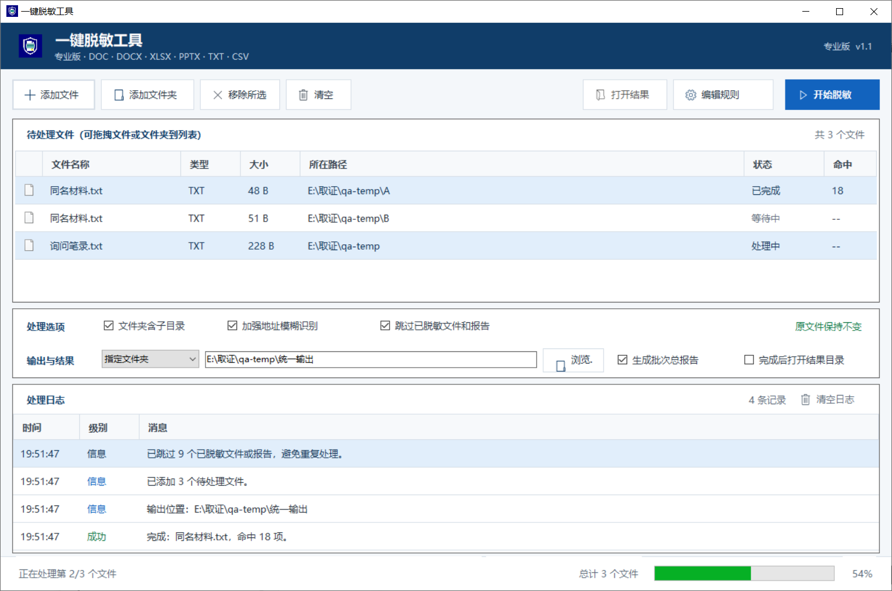

# 一键脱敏工具

这是一个完全离线运行的 Windows 桌面工具，用于批量脱敏 `doc/docx/docm`、`xlsx/xlsm`、`pptx/pptm`、`txt/csv` 文件。原始文件不会被修改，工具会生成带 `_已脱敏` 后缀的新文件和脱敏报告。



## 版本选择

| 版本 | 适合场景 | 主要特点 |
| --- | --- | --- |
| `v1.0 轻量版` | 临时处理、旧电脑、只需要基础批量脱敏 | 操作简单、体积较小、原目录输出 |
| `v1.1 专业版` | 公安、法院及其他需要反复处理材料的场景 | 专业界面、独立图标、统一输出目录、队列管理、结果直达和批次报告 |

## 专业版增强功能

- 自定义“盾牌 + 脱敏文档”应用图标，任务栏、窗口和 exe 文件统一显示
- 可选择在原文件旁输出，或将全部脱敏结果统一保存到指定文件夹
- 默认跳过 `_已脱敏` 文件、单文件报告和批次报告，避免重复加工
- 支持多选移除、清空列表、清空日志、双击打开脱敏结果
- 支持处理完成后自动打开结果目录，也可以随时点击“打开结果”
- 支持关闭批次总报告；单文件脱敏报告仍随结果文件生成
- 同一批次存在同名文件时自动生成唯一文件名，不会互相覆盖

## 默认识别内容

- 身份证号、手机号、座机号、邮箱
- 年龄、姓名标签后的姓名、地址标签后的住址
- 庭审笔录中的审判员、法官助理、书记员、原告、被告、代理人等角色姓名；识别后会在当前文档内统一脱敏
- 公安文书中的办案民警、侦查/调查/询问/讯问人员、记录人、报案/控告/举报人、违法或犯罪嫌疑人、被询问/被讯问人、见证/辨认/勘验/检查/搜查人员等角色姓名
- 支持同一角色后的多人姓名，例如“办案民警：张三、李四”；已识别姓名会在当前文档后续正文中统一脱敏
- 统一社会信用代码、银行卡/账号、护照号、车牌号
- 企业/单位名称标签后的内容，以及常见公司名称格式

## 使用方式

1. 打开 `一键脱敏工具.exe`。
2. 添加文件或文件夹，也可以直接拖拽文件/文件夹。
3. 点击“开始脱敏”。
4. 点击“打开结果”，或到选择的输出目录查看 `_已脱敏` 文件和 `.脱敏报告.txt`。

也可以命令行批量处理：

```powershell
.\一键脱敏工具.exe "D:\待脱敏材料"
.\一键脱敏工具.exe "D:\待脱敏材料\样本.doc" "D:\待脱敏材料\样本.docx" "D:\待脱敏材料\表格.xlsx"
.\一键脱敏工具.exe --output="D:\脱敏输出" "D:\待脱敏材料"
.\一键脱敏工具.exe --include-redacted "D:\待脱敏材料"
```

命令行默认同样会跳过已脱敏文件和报告；只有明确需要再次处理时才使用 `--include-redacted`。

## 补充规则

程序同目录会自动生成 `脱敏补充规则.txt`。可以把专案中明确需要处理的姓名、地址、企业名、账号等写进去，一行一条：

```text
张三
某某科技有限公司=>涉案企业
```

左边是原文，右边是替换后的内容；没有写 `=>` 时默认替换成 `***`。

## 重新编译

在 PowerShell 中执行：

```powershell
.\build.ps1
```

## 注意事项

- `.doc` 支持 Word 97-2003 二进制文档，输出仍为 `.doc`，不依赖本机安装 Office。加密、损坏或实际内容并非 Word 二进制格式的 `.doc` 会明确报错。
- 暂不支持旧版二进制 `.xls`，建议先在 Office 或 WPS 中另存为 `.xlsx`。
- `.doc` 是结构复杂的老格式，含特殊域、嵌入对象或异常排版的文件应在脱敏后用 Word/WPS 打开抽查。
- 为保护 `.doc` 的内部结构，程序不会让替换后的段落变长；若补充规则中的替换文字长于原文，会自动使用较短的脱敏内容。
- 自动识别姓名、地址、企业名存在天然误判或漏判风险。专案中明确的人名、地名、单位名建议写入 `脱敏补充规则.txt` 后再批量处理。
- 脱敏后建议抽查一份 Word、一份 Excel 和一份报告，确认规则符合本次材料要求。
